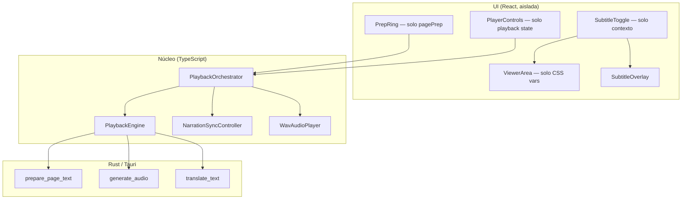

# Plan: motor de prep/reproducción robusto e instantáneo

> **Para:** Simple Narrator  
> **Objetivo:** eliminar los 3 bugs reportados (subtítulos sin play, narración que se traba/retrocede, cuelgue al cambiar páginas) con un diseño simple, determinista y rápido.

---

## 1. Diagnóstico (causa raíz)

### Bug A — Subtítulos no abren/cierran sin Play

**Síntoma:** el toggle de subtítulos no responde (o parece no responder) hasta dar Play.

**Causas identificadas en código:**

| # | Causa | Archivo |
|---|--------|---------|
| A1 | `handleSubtitleVisibilityChange` **sale inmediatamente** si no hay reproducción activa (`playingRef` false y `activeChunkIndex < 0`). Eso solo debería afectar el *texto* del subtítulo, no el panel — pero mezcla responsabilidades. | `usePodcastPlayer.ts:602-606` |
| A2 | `DocumentHeader` consume **dos fuentes de re-render pesadas**: `pagePrep` (actualizaciones cada fragmento) + `useSubtitleVisibility`. El botón de subtítulos se re-monta/re-renderiza decenas de veces durante la prep → clics perdidos o UI “congelada” en Tauri. | `DocumentHeader.tsx`, `AppShell.tsx` |
| A3 | El panel sí depende solo de `visible` en contexto (correcto), pero el **layout del PDF** (`--subtitle-gutter`, `--pdf-visual-scale`) se actualiza en `useLayoutEffect` al togglear. Si el hilo principal está saturado por prep (Rust + síntesis), el toggle *parece* no funcionar. | `ViewerArea.tsx` |

**Conclusión:** el panel es independiente de Play en diseño, pero la **contención de UI** (re-renders del header + trabajo en background) rompe la experiencia antes de Play.

---

### Bug B — Play: se traba, “vuelve atrás”, luego lee bien

**Síntoma:** al dar Play la narración arranca mal (highlight/audio desincronizado o reinicio), luego se corrige.

**Causas identificadas:**

| # | Causa | Archivo |
|---|--------|---------|
| B1 | **Pipeline serial bloqueante antes del audio:** `resolveSubtitle()` (llamada `translateText` a Rust) se `await` *antes* de `beginChunk` + `player.play()`. Con subtítulos ON, el audio arranca tarde; el usuario percibe “traba”. | `usePodcastPlayer.ts:476-498` |
| B2 | **Highlight arranca en 0 ms** con `beginChunk` → `lastTimeMs = 0`, pero el audio aún no existe (`WavAudioPlayer.play` destruye y recrea `<audio>`, espera `canplaythrough`). El resaltado “va adelantado” y al empezar el audio parece “volver atrás” al sincronizar. | `narrationSync.ts:55-82`, `wavAudioPlayer.ts:103-205` |
| B3 | **Doble preparación conceptual:** el `useEffect` de prep en background y `runPlayback()` ambos llaman `ensurePage` / `waitForFirstChunk`. No es incorrecto, pero `runPlayback` vuelve a marcar `status: preparing` y re-entra al pipeline completo en lugar de **adjuntarse** a la sesión ya lista. | `usePodcastPlayer.ts:371-408`, `662-764` |
| B4 | Cada fragmento: `disposeAudio()` + nueva carga WAV → gap audible entre chunks (aceptable entre fragmentos; en el **primer** fragmento es evitable si el WAV ya está en caché). | `wavAudioPlayer.ts:103-104` |

**Modelo mental (timing):**

```text
Hoy:
  [await translate] → beginChunk(t=0) → [load wav…] → play() → ticks
                         ↑ highlight en palabra 0
                                    ↑ usuario ve “salto hacia atrás”

Objetivo:
  beginChunk + preload wav → play() → primer tick al evento 'playing'
```

---

### Bug C — Cambio manual de páginas → porcentajes distintos → cuelgue

**Síntoma:** navegar páginas muestra % correctos por página, pero tras varios cambios la app se tilda.

**Causa raíz (crítica):**

| # | Causa | Archivo |
|---|--------|---------|
| C1 | Al cambiar página (`goToPage`), **no se cancela** la prep de páginas abandonadas en `PlaybackEngine`. El cleanup del `useEffect` solo hace `cancelled=true` + `unsubscribe()` — el trabajo Rust/síntesis **sigue en background**. | `usePodcastPlayer.ts:354-368`, `760-763` |
| C2 | Cada página nueva crea un **slot distinto** en `slots` (`cacheKey` incluye `page`). Navegar 1→5→10→15 deja **4 bootstraps activos** (`preparePageText`) + `prepareRemainingChunks` encadenados en `SerialTaskQueue`. | `playbackEngine.ts:172-214`, `391-411` |
| C3 | `cancelAll()` solo se llama al cerrar documento o cambiar idioma — **no al cambiar página**. | `usePodcastPlayer.ts:589`, `623` |
| C4 | `slots` acumula estados `aborted` sin eliminar entradas → memoria + cola de síntesis crece → UI sin respuesta. | `playbackEngine.ts:163-170`, `184-187` |

**Esto es un clásico problema de “trabajo abandonado sin cancelación” — O(n) páginas visitadas = O(n) trabajo acumulado.**

---

## 2. Principios de diseño (Simple = simple)

1. **Una página “dueña”** — solo la página visible tiene prep activa con prioridad.
2. **Un prefetch opcional** — máximo la página siguiente (lookahead +1).
3. **Cancelación explícita** — al cambiar página, abortar todo lo que no sea `current` ni `current+1`.
4. **UI desacoplada del motor** — toggles y layout nunca dependen del estado de reproducción.
5. **Audio primero, subtítulos después** — nunca bloquear `play()` por traducción.
6. **Sync en el evento correcto** — resaltado anclado al primer `playing` / `timeupdate`, no a `beginChunk` prematuro.

---

## 3. Arquitectura objetivo



### 3.1 Estados del orquestador (máquina finita)

```text
idle          → sin documento
loading_pdf   → visor PDF
prep_view     → prep de currentPage (background)
ready         → chunk 0 listo, Play habilitado
playing       → narración activa
paused        → audio pausado, sesión viva
error         → fallo recuperable
```

Transiciones clave:

- `prep_view → ready` cuando `chunksPrepared >= 1` y `status === ready|synthesizing` con chunk 0 en caché.
- `ready → playing` en `play()` sin re-bootstrap si la sesión del motor ya existe.
- `playing → prep_view` solo al cambiar página manualmente (cancelar + nueva prep).
- **Nunca** `cancelAll()` entero al cambiar página — solo `releasePage(except)`.

---

## 4. Algoritmo de prep (robusto)

### 4.1 Política de slots en `PlaybackEngine`

```typescript
// Nueva API (reemplaza comportamiento implícito actual)
releasePage(params: PagePrepParams): void      // abort + delete slot
retainOnly(allowedKeys: string[]): void        // cancela y borra el resto
ensurePage(params): PageSession                // como hoy, pero...
prefetchNext(params): void                     // solo si no hay slot y current ready
```

**Al cambiar a página P:**

```text
1. retainOnly([key(P), key(P+1)])   // aborta P-1, P-2, … todo lo demás
2. synthesisQueue.bump()            // descarta tareas pendientes obsoletas
3. ensurePage(P)                    // prep prioritaria
4. si P < pageCount: prefetch(P+1)  // opcional, baja prioridad
```

**Invariantes:**

- `|slots| ≤ 2` en estado estable.
- Cada slot `aborted` se **elimina** del `Map` tras abort (no acumular).
- `subscribeProgress` solo para `currentPage` (un listener activo).

### 4.2 Cola de síntesis (dos niveles)

```text
Prioridad ALTA:  chunk 0 de currentPage
Prioridad MEDIA: chunks 1..n de currentPage (secuencial)
Prioridad BAJA:  chunk 0 de currentPage+1 (prefetch)
```

Implementación: segunda cola o prioridad en `SerialTaskQueue` (token de generación + `priority` en task).

### 4.3 Progreso UI (%)

- El % refleja **solo** `currentPage` (ya ocurre en UI, pero el motor debe dejar de notificar páginas abortadas).
- Al cambiar página: reset visual inmediato a “analyzing 6%” sin esperar cleanup async.

---

## 5. Algoritmo de reproducción (instantáneo)

### 5.1 `play()` — sin re-trabajo

```text
play():
  if paused → resume audio (como hoy)
  if not ready → return (botón deshabilitado)
  session = engine.getSession(currentPage)  // NO ensurePage si ya ready
  if !session?.result → return
  startPlaybackLoop(session)              // sin waitForFirstChunk redundante
```

### 5.2 Loop por fragmento (orden corregido)

```text
for each chunk i:
  bundle = await engine.getChunkBundle(params, i)     // ya en caché o en cola
  sync.armChunk(sourceText, alignment)                // prepara datos, NO highlight aún
  await player.preload(bundle.path)                   // nuevo: calentar src
  subtitlePromise = resolveSubtitle(prep, i)          // paralelo, NO await aquí
  sync.beginChunkOnPlay(sourceText, alignment)        // lastTimeMs = 0, sin paint
  player.playPreloaded()
  on first 'playing' → sync.startClock()
  subtitlePromise.then(t => sync.updateSubtitle(t))   // subtítulo llega tarde, OK
  await player.waitEnded()
  sync.endChunk()
```

### 5.3 `WavAudioPlayer` — mejoras mínimas

- `preload(path)` — asigna `src`, `load()`, espera `canplaythrough`, **no** reproduce.
- `playPreloaded()` — `audio.play()` sin `disposeAudio` si mismo path.
- Entre chunks distintos: swap `src` sin destruir listeners (reutilizar elemento).

---

## 6. Subtítulos — siempre toggleables

### 6.1 Separar responsabilidades

| Componente | Responsabilidad |
|------------|-----------------|
| `SubtitleVisibilityContext` | Solo `visible` + `panelWidthPx` |
| `SubtitleToggle` (nuevo) | Botón memo, **solo** consume contexto |
| `ViewerArea` | CSS vars al togglear |
| `SubtitleOverlay` | Panel visible/oculto |
| `PlaybackOrchestrator` | `refreshSubtitleIfPlaying()` solo si `playing` |

**Eliminar** el early-return global en `handleSubtitleVisibilityChange` que impide cualquier lógica futura. Sustituir por:

```typescript
onSubtitlePanelToggle(enabled: boolean) {
  // UI ya actualizada por contexto — nada aquí
}
onSubtitleSyncNeeded() {
  if (playingRef.current) refreshSubtitleForCurrentChunk();
}
```

### 6.2 Aislar re-renders del header

```text
DocumentHeader
  ├── HeaderTitle (document, drag)
  ├── HeaderTransport (PlayerControls — memo)
  ├── HeaderPrepRing (PrepProgressIndicator — memo)
  └── HeaderSettings (idioma + SubtitleToggle — memo)
```

`pagePrep` **no** debe pasar por `DocumentHeader` wrapper — solo a `HeaderPrepRing`.

---

## 7. Plan de implementación por fases

### Fase 0 — Instrumentación (1 PR, bajo riesgo)

- [ ] Contador dev: slots activos, cola síntesis, prepId, página dueña.
- [ ] `console.time` / trace en: `goToPage`, `play`, `ensurePage`, `cancel`.
- [ ] Reproducir los 3 bugs con logs antes de tocar lógica.

**Archivos:** `playbackEngine.ts`, `usePodcastPlayer.ts` (solo logs dev).

---

### Fase 1 — Cancelación al cambiar página (Bug C) **CRÍTICO**

- [ ] `PlaybackEngine.releasePage(params)` — abort, resolveFirst, delete slot, bump queue.
- [ ] `PlaybackEngine.retainOnly(keys: string[])` — abort+delete todos los demás.
- [ ] `goToPage`: llamar `retainOnly([current, current+1])` + `synthesisQueue.bump()`.
- [ ] Cleanup del `useEffect` de prep: `releasePage(params)` del efecto anterior.
- [ ] Test: navegar 20 páginas rápido → `slots.size ≤ 2`, app responde.

**Archivos:** `playbackEngine.ts`, `usePodcastPlayer.ts`.

---

### Fase 2 — UI subtítulos instantánea (Bug A)

- [ ] Crear `SubtitleToggle.tsx` (memo, solo contexto).
- [ ] Crear subcomponentes de header (`HeaderPrepRing`, `HeaderTransport`, `HeaderSettings`).
- [ ] Mover `pagePrep` solo a `HeaderPrepRing`.
- [ ] Separar `onVisibilityChange` en contexto: UI vs sync (o eliminar hook sync del toggle).
- [ ] Test manual: togglear 10 veces durante prep sin Play → panel abre/cierra al instante.

**Archivos:** `DocumentHeader.tsx`, nuevos componentes, `SubtitleVisibilityContext.tsx`, `AppShell.tsx`.

---

### Fase 3 — Pipeline de play sin bloqueos (Bug B)

- [ ] `resolveSubtitle` en paralelo (no `await` antes de audio).
- [ ] `NarrationSyncController.armChunk` + `startClock()` en evento `playing`.
- [ ] `WavAudioPlayer.preload` + `playPreloaded`.
- [ ] `runPlayback`: adjuntar sesión existente; quitar `waitForFirstChunk` redundante si `pagePrepStatus === ready`.
- [ ] Test: Play con subtítulos ON → audio arranca en <300 ms tras click; highlight no “salta atrás”.

**Archivos:** `usePodcastPlayer.ts`, `narrationSync.ts`, `wavAudioPlayer.ts`.

---

### Fase 4 — Prefetch disciplinado + polish

- [ ] Prefetch solo `currentPage + 1` tras `ready`.
- [ ] Prioridad en cola de síntesis.
- [ ] Al `closeDocument`: `cancelAll()` (ya existe).
- [ ] Al cambiar idioma: `cancelAll()` (ya existe).

---

### Fase 5 — Tests automatizados

- [ ] `playbackEngine.test.ts`: retainOnly, releasePage, no leak de slots.
- [ ] `pagePrepProgress.test.ts`: shouldShowPrepIndicator.
- [ ] Test integración (opcional): mock engine, simular 10 goToPage.

---

## 8. Criterios de éxito (medibles)

| Métrica | Hoy (estimado) | Objetivo |
|---------|----------------|----------|
| Toggle subtítulos durante prep | Falla / lag | < 50 ms perceived |
| Time to first audio tras Play | 0.5–3 s (+ translate) | < 400 ms (chunk 0 ya listo) |
| Highlight vs audio offset | visible “salto” | < 80 ms |
| Slots tras 20 cambios de página | 20+ | ≤ 2 |
| App responsive tras navegación | cuelgue | sin freeze |

---

## 9. Orden de PRs recomendado

1. **PR1:** Fase 1 (cancelación) — arregla el cuelgue; máximo impacto.
2. **PR2:** Fase 2 (UI subtítulos) — arregla toggle sin play.
3. **PR3:** Fase 3 (pipeline play) — arregla traba/retroceso.
4. **PR4:** Fase 4 + tests.

Cada PR debe ser mergeable y verificable por sí solo.

---

## 10. Riesgos y mitigaciones

| Riesgo | Mitigación |
|--------|------------|
| `bump()` cancela síntesis del chunk que se está reproduciendo | `retainOnly` nunca aborta la página en reproducción activa |
| Subtítulo llega tarde | Mostrar source chunk en panel hasta que llegue traducción |
| Regresión en multi-página automática (play hasta fin) | Mantener loop `runPlayback`; solo cambia adjunción y cancelación |

---

## 11. Resumen ejecutivo

Los tres bugs **no son independientes**: comparten un motor de prep sin ciclo de vida claro y una UI acoplada al mismo estado que la reproducción. La solución “simple” es:

1. **Cancelar trabajo abandonado** al cambiar página (fix del cuelgue).
2. **Desacoplar UI** del motor (fix subtítulos).
3. **Audio antes que traducción; sync en `playing`** (fix traba/retroceso).

Con `|slots| ≤ 2` y cola priorizada, la app se comporta como un lector lineal predecible: **una página en foco, una de lookahead, cero basura acumulada.**
